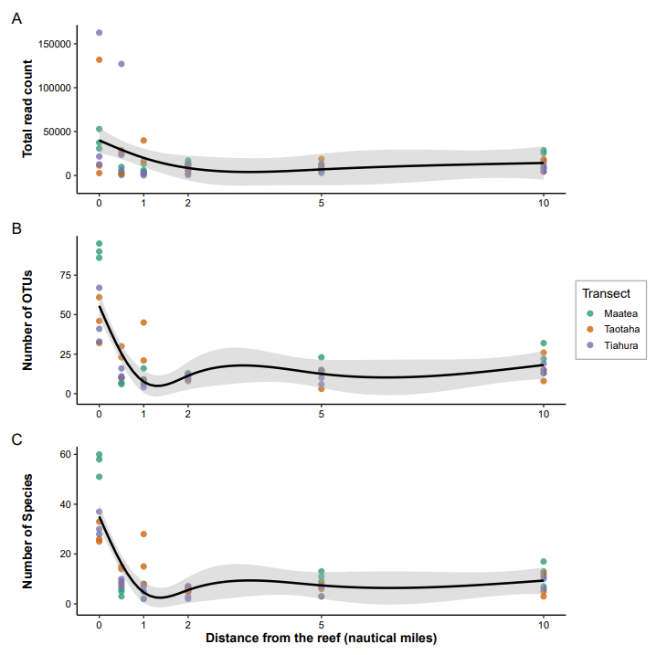
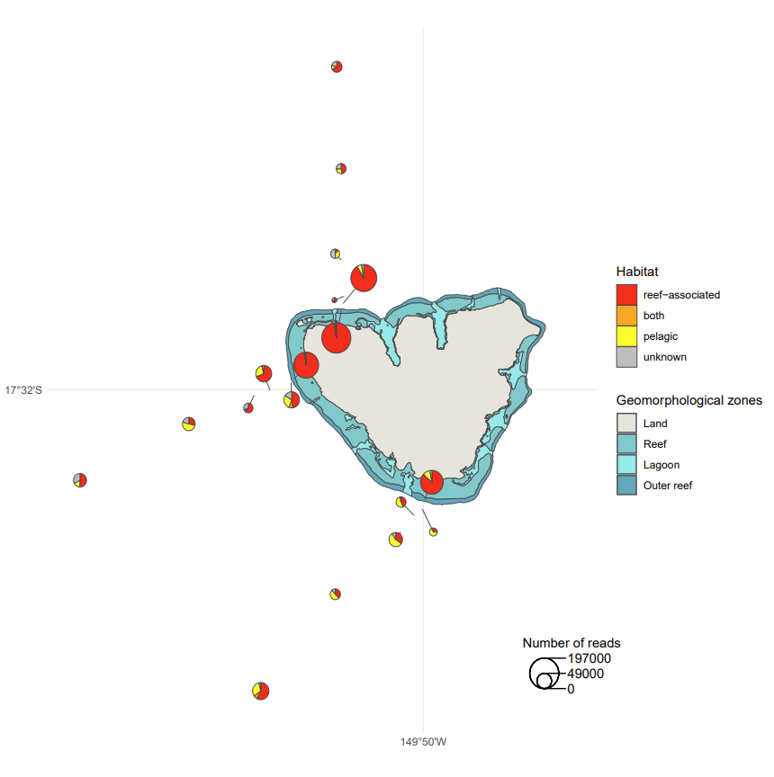
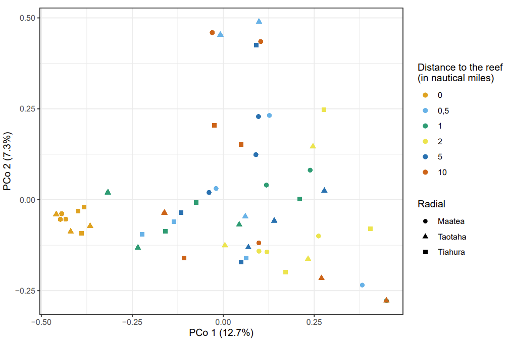

These R scripts reproduce the figures presented in the paper:
Evaluating Environmental DNA for Assessing Fish Biodiversity across a Reef-to-Open-Ocean Gradient in French Polynesia
DOI

The methodological choices and the bioinformatics pipeline are described in:
Optimizing a novel eDNA-based framework for Reef Fish Biodiversity monitoring using an Autonomous Filtration System and in situ Nanopore Sequencing
DOI
https://github.com/LucieCartairade/eDNA_Methodology


## Manage files and set the environment 
```r
set.seed(19980822)

# Libraries always needed
library(ggplot2)
library(dplyr)
library(patchwork)
theme_set(theme_bw())
source("Functions.R")

# Reading metadata file
metadata <- read.csv(file = "metadata.csv", header = T, sep = ";", dec = ",", na.strings = "NA", fileEncoding = "ISO-8859-1")
metadata$Barcod <- sprintf("%02d",metadata$Barcod)
metadata$Run_Barcod <- paste0(metadata$Run.name,"_barcode",metadata$Barcod,"_concatenated")

# Reading Correction file to stay up to date and be consistent between UVC and eDNA results
corr_species <- read.csv2("correction_species_final.csv")
corr_family <- read.csv2("correction_family_final.csv")

# Reading Decona result file
Res <- read.table("BLAST_out_reclustered_summary_tax_seq_counts.txt",sep ="\t", header = T, na.string = "")
# Removing Homo Sapiens 
Res <- Res[-which(Res$tax.id == "9606"),] 
rownames(Res) <- Res$clusters.id

# Rarefying reads
Tab_raw <- Res[,15:dim(Res)[2]]
raremax <- min(rowSums(t(Tab_raw), na.rm = T)) 
Tab_rar <- vegan::rrarefy(t(Tab_raw), raremax)
Tab_rar <- as.data.frame(t(Tab_rar))
Tab_rar$clusters.id <- row.names(Tab_rar)
Res_rar <- dplyr::right_join(as.data.frame(Res)[,c(1:14)], Tab_rar, by = c("clusters.id" = "clusters.id"))

# Transforming data to merge with metadata 
Res_melt_rar <- reshape2::melt(Res_rar[,c(1,15:dim(Res_rar)[2])], id = "clusters.id", variable.name = "Run_Barcod", value.name = "Nb.reads")
Res_melt_rar <- Res_melt_rar[Res_melt_rar$Nb.reads != 0,]
Res_melt_rar <- merge(Res_melt_rar,Res[,c(1:(14))], by = "clusters.id", all = T)
Res_melt_rar <- merge(Res_melt_rar, metadata[,c("Run_Barcod","Sample.ID","Sampling.Site","Distance.to.Reef..Nautic.Miles.","Replica")], by = "Run_Barcod", all = T)
# Removing samples that haven't any result
Res_melt_rar <- Res_melt_rar[!is.na(Res_melt_rar$clusters.id),] 
# Creating Taxon column
Res_melt_rar[which(is.na(Res_melt_rar$Family)),c("Family","Genus","Species")] <- "unknown"
Res_melt_rar$Taxon <- ifelse(is.na(Res_melt_rar$Genus), Res_melt_rar$Family,paste(Res_melt_rar$Genus, Res_melt_rar$Species))

# Aggregating to Species level
Tax_melt <- Res_melt_rar %>%
  group_by(tax.id, Sample.ID, Replica, Family, Taxon, Distance.to.Reef..Nautic.Miles., Sampling.Site) %>%
  summarise(
    Nb.reads_sum = sum(Nb.reads),
    X.ID_mean = weighted.mean(X.ID, Nb.reads),
    alignment.length_mean = weighted.mean(alignment.length, Nb.reads),
    mismatches_mean = weighted.mean(mismatches, Nb.reads),
    gap.opens_mean = weighted.mean(gap.opens, Nb.reads),
    evalue_mean = weighted.mean(evalue, Nb.reads),
    bit.score_mean = weighted.mean(bit.score, Nb.reads),
    qcovs_mean = weighted.mean(qcovs, Nb.reads),
    sequence_max = sequence[which.max(Nb.reads)][1]
  ) %>%
  group_by(Sample.ID) %>%
  mutate(
    relative_biomass = 100 * Nb.reads_sum / sum(Nb.reads_sum)
  ) %>%
  ungroup()

Tax_melt[which(Tax_melt$bit.score_mean < 250),"Taxon"] <- "unknown"
Tax_melt[which(Tax_melt$bit.score_mean < 250),"Family"] <- "unknown"
Tax_melt[which(Tax_melt$bit.score_mean < 250),"X.ID_mean"] <- NA

# Correcting some species and family names
Tax_melt <- Tax_melt %>%
  left_join(corr_species, by = c("Taxon" = "original_species")) %>%
  mutate(Taxon = coalesce(corrected_species, Taxon)) %>%
  select(-corrected_species) %>%
  left_join(corr_family, by = c("Taxon" = "species")) %>%
  mutate(Family = coalesce(corrected_family, Family)) %>%
  select(-corrected_family)

# Assigning unknown to bitscore < 250 
Tax_melt$Sample.Type <- "eDNA"
Tax_melt$Sample.ID <- paste(Tax_melt$Sample.Type, Tax_melt$Marine.Area, Tax_melt$Sampling.Site, Tax_melt$Habitat, Tax_melt$Replica)
Tax_table <- reshape2::acast(Tax_melt, value.var = "Nb.reads_sum", Taxon~Sample.ID, fill = 0, fun.aggregate = sum)

# Joining eDNA table Ecological datas (position in the water)
Tab_eco <- read.csv2("Tab_eco.csv", header = T, row.names = 1)
table(Tab_eco$DemersPelag)
Tab_eco$tax.id <- as.character(Tab_eco$tax.id)
Tax_melt <- left_join(Tax_melt, Tab_eco, by = c("Taxon" = "Species", "tax.id" = "tax.id", "Family" = "Family"))


# Shaping into table 
Tax_table <- reshape2::acast(Tax_melt, value.var = "relative_biomass", Taxon~Sample.ID, fill = 0, fun.aggregate = sum)
```

##  Generating Figures from the paper
### Figure 1: Variation in sequencing read counts (A), OTU richness (B), and species richness (C) across the three offshore transects from Moorea’s outer reef to the open ocean.
<p align="center">
  
</p>

```r
# Number of reads
Tab_Nb.reads <- Res_melt %>%
  group_by(Sampling.Site, Replica, Distance.to.Reef..Nautic.Miles.) %>%
  summarise(Nb.reads_sum = sum(Nb.reads))
Tab_Nb.reads$Distance.to.Reef..Nautic.Miles. <- as.numeric(gsub(",", ".", as.character(Tab_Nb.reads$Distance.to.Reef..Nautic.Miles.)))

p_gam_Nb.reads <- GAM_model_plot(data  = Tab_Nb.reads, k = 5, y = "Nb.reads_sum", ylab = "Total read count")

# OTU count
counted_Tab_OTU <- Res_melt_rar %>%
  count(Sampling.Site, Replica, Distance.to.Reef..Nautic.Miles.)
counted_Tab_OTU$Distance.to.Reef..Nautic.Miles. <- as.numeric(gsub(",", ".", as.character(counted_Tab_OTU$Distance.to.Reef..Nautic.Miles.)))

p_gam_OTU <- GAM_model_plot(data = counted_Tab_OTU, k = 5, y = "n", ylab = "Number of OTUs")

# Taxa count
counted_Tab_Species <- Tax_melt %>%
  count(Sampling.Site, Replica, Distance.to.Reef..Nautic.Miles.)
counted_Tab_Species$Distance.to.Reef..Nautic.Miles. <- as.numeric(gsub(",", ".", as.character(counted_Tab_Species$Distance.to.Reef..Nautic.Miles.)))

p_gam_Species <- GAM_model_plot(data = counted_Tab_Species, k = 5, y = "n", ylab = "Number of Species")

# Combine plots 
( p_gam_Nb.reads | p_gam_OTU | p_gam_Species ) + 
  plot_annotation(tag_levels = 'A') + 
  plot_layout(ncol = 1, nrow = 3, 
              axis_titles = "collect",
              guide = "collect")
ggsave(path = Images_path, filename = "Figure1.pdf", width = 10, height = 10)
```

### Figure 2: Proportional composition of fish reads by habitat type at each sampling station along the three radial transects extending from the outer reef slope of Moorea to offshore waters.
<p align="center">
  
</p>

Shapefiles available at : https://www.tefenua.data.gov.pf
and : https://www.tefenua.data.gov.pf/datasets/ef2bdc8e55f049318a3888f8134349b0_0/explore?location=-17.535984%2C-149.840113%2C11.48

```r
my_sf <- sf::read_sf("WGS84_TraitDeCote.shp", options = "ENCODING=UTF-8")
sf_Moorea <- my_sf %>% filter(ILE == "MOOREA")

sf_Moorea <- sf_Moorea %>%
  mutate(Carto = recode(Carto,
                        "Terre" = "Land",
                        "Récif" = "Reef",
                        "Lagon" = "Lagoon",
                        "Tombant" = "Outer reef"
  ))

sf_Moorea$Carto <- factor(sf_Moorea$Carto, levels = c("Land", "Reef", "Lagoon", "Outer reef"))

coord <- read.csv(file = "Offshore.csv", header = T, sep = ";", dec = ".", na.strings = "NA", fileEncoding = "ISO-8859-1")
coord <- sf::st_as_sf(coord, coords = c("X", "Y"),  crs = 4326)

###### Color palettes 
palette <- c(
  Land = "#e6e4dc",
  Reef = "#77cbcd",
  Lagoon = "#8aeae9",
  `Outer reef` = "#55aabd"
)

# Calculate proportions by category (including NAs)
Proportion <- Tax_melt %>%
  group_by(Sampling.Site, Replica, Distance.to.Reef..Nautic.Miles., DemersPelag) %>%
  summarise(Sum_Nb_reads = sum(Nb.reads_sum), .groups = "drop") %>%
  mutate(DemersPelag = ifelse(is.na(DemersPelag), "unknown", DemersPelag)) %>%
  group_by(Sampling.Site, Replica, Distance.to.Reef..Nautic.Miles.) %>%
  mutate(Proportion = Sum_Nb_reads / sum(Sum_Nb_reads)) %>%
  ungroup()

# Summarize by site and distance (mean proportions across replicates)
df_plot <- Proportion %>%
  group_by(Sampling.Site, Distance.to.Reef..Nautic.Miles., DemersPelag) %>%
  summarise(Proportion = mean(Proportion, na.rm = TRUE), .groups = "drop") %>%
  tidyr::pivot_wider(names_from = DemersPelag, values_from = Proportion, values_fill = 0) %>%
  left_join(coord, by = c("Sampling.Site" = "Name", "Distance.to.Reef..Nautic.Miles." = "NM"))

# Add total number of reads for pie chart size scaling
tmp <- Res_melt %>%
  filter(!is.na(Replica)) %>%
  group_by(Sampling.Site, Distance.to.Reef..Nautic.Miles.) %>%
  summarise(Nb.reads_sum = sum(Nb.reads))

df_plot <- df_plot %>%
  left_join(tmp, by = c("Sampling.Site", "Distance.to.Reef..Nautic.Miles."))

# Extract X/Y coordinates from geometry
coords <- sf::st_coordinates(df_plot$geometry)
df_plot <- df_plot %>%
  mutate(X = coords[, 1], Y = coords[, 2])

sf_Moorea <- sf::st_transform(sf_Moorea, 4326) 

cols_colors <- c("reef-associated" = "red",
                 "pelagic" = "yellow",
                 "both" = "orange",
                 "unknown" = "gray")

# Scale pie chart radius according to read counts
df_plot <- mutate(df_plot,
                  radius = sqrt(Nb.reads_sum) / max(sqrt(Nb.reads_sum)) * 0.01)

# Compute adjusted coordinates (repelled positions)
new_coords <- repel_points_simple(df_plot$X, df_plot$Y, df_plot$radius, repel_strength = 5)

df_plot$X2 <- new_coords$X2
df_plot$Y2 <- new_coords$Y2

# Generate final plot
ggplot() +
  # Geomorphological background
  geom_sf(data = sf_Moorea, aes(fill = Carto), color = "gray30") +
  scale_fill_manual(values = palette, name = "Geomorphological zones") +
  ggnewscale::new_scale_fill() +
  
  # Segments linking real GPS points to shifted pie positions
  geom_segment(
    data = df_plot,
    aes(x = X, y = Y, xend = X2, yend = Y2),
    color = "gray30", size = 0.1
  ) +
  
  # Displaced scatter pies
  scatterpie::geom_scatterpie(
    aes(x = X2, y = Y2, r = radius),
    data = df_plot,
    cols = c("reef-associated", "both", "pelagic", "unknown"),
    color = "gray30", size = 0.1
  ) +
  scale_fill_manual(values = cols_colors, name = "Habitat") +
  
  # Theme and axes
  theme_minimal() +
  scale_x_continuous(labels = "149°50′W", breaks = -149.83333) +
  scale_y_continuous(labels = "17°32′S", breaks = -17.5333312) +
  theme(
    plot.title = element_blank(),
    axis.title.x = element_blank(),
    axis.title.y = element_blank()
  ) +
  
  # Pie size legend
  scatterpie::geom_scatterpie_legend(
    df_plot$radius,
    x = -149.75, y = -17.72,
    n = 3,
    labeller = function(r) {
      round((r / 0.01 * max(sqrt(df_plot$Nb.reads_sum)))^2, -3)
    }
  ) +
  annotate("text", x = -149.731, y = -17.70, label = "Number of reads") +
  
  # Allow pies and segments to extend beyond plot limits
  coord_sf(clip = "off")

ggsave(path = Images_path, file = "Figure2.pdf", height = 9, width = 9, dpi = 300)
```

### Figure 2: Principal Coordinates Analysis on Jaccard matrix distance
<p align="center">
  
</p>

```r
dist.jc <- betapart::beta.pair(t(ifelse(Tax_table != 0 , 1, 0)), index.family="jaccard")

pcoa <- cmdscale(dist.jc$beta.jac, eig = T, add = T)
position <- pcoa$points[,c(1,2)]
colnames(position) <- c("Dim1","Dim2")

percent_explained <- round(100 * pcoa$eig / sum(pcoa$eig), digits = 1)
labs <- c(glue::glue("PCo 1 ({percent_explained[1]}%)"), glue::glue("PCo 2 ({percent_explained[2]}%)"))

pcoa_data <- merge(as.data.frame(position), as.data.frame(Tax_melt), by.x = 0, by.y = "Sample.ID")

ggplot(data = pcoa_data, aes(x = Dim1, y = Dim2)) +
  geom_point(aes(color = Distance.to.Reef..Nautic.Miles.,
                 shape = Sampling.Site), size = 2) +
  ggokabeito::scale_color_okabe_ito(name = "Distance to the reef\n(in nautical miles)") +
  scale_shape_discrete(name = "Radial") +
  labs(x = labs[1], y = labs[2]) +
  coord_equal()

ggsave(file = paste0(Images_path, "Figure3_PCoA_Jaccard.pdf"), width = 8, height = 6)
```